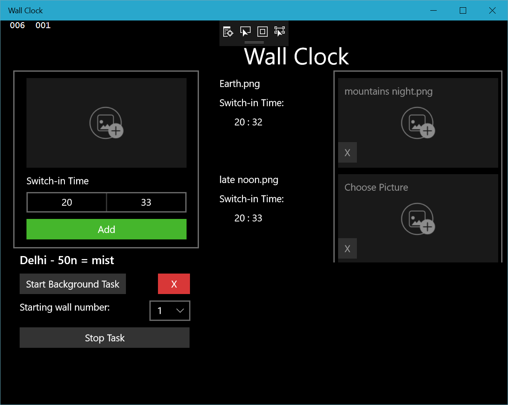

# Wallpaper-Clock
This is an Universal Windows Platform application that lets you select a list of pictures from your computer and assign to them a certain time or weather condition that you want that picture set as your wallpaper.

Below is a screenshot of the UI. 
The list in the center are the chosen pictures with time conditions, and the list to the right (with the placeholder images) are the images chosen with weather conditions. Below the add button is the current reference city, chosen by location or manual selection.

#### Building
To build this as a UWP application, open the solution in Visual Studio and export the project as a UWP app. You can also just run it in the visual studio emulator.

Note: Due to limitations in UWP, picture conditions are checked at 15-minute intervals.
